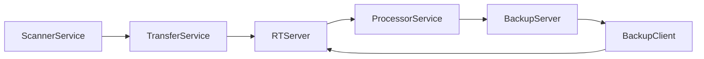

# Architecture

## Key System Capabilities

1. __File Indexing & Organization__

   - Scans and indexes files across multiple local drives
   - Supports automatic file categorization (photos, videos, audio, documents)
   - Provides tagging functionality for file organization
   - Tracks file metadata and creates searchable indexes

2. __Multi-Platform Access__

   - Web-based interface for desktop browsers
   - Native mobile support for iOS and Android devices
   - RESTful API for remote file access
   - Streaming support for media files (including HLS for video)

3. __File Sharing & Collaboration__

   - User authentication with admin and regular user roles
   - Secure file sharing with specific users or groups
   - Email integration for sending files and share notifications
   - Support for public/private file access controls

4. __Distributed Storage Architecture__

   - Supports multiple storage nodes in a cluster
   - File replication across nodes for redundancy
   - Remote cluster connectivity for accessing files from other Alterante servers
   - Load balancing and failover capabilities

5. __Backup & Sync Features__

   - Automated backup to designated folders
   - Sync functionality between multiple drives/nodes
   - Integration with Amazon Cloud Drive for cloud backup
   - Configurable retention and replication policies

6. __Security & Privacy__

   - RSA and AES encryption for secure communications
   - Session-based authentication with UUID tokens
   - Support for hidden/private file collections
   - Secure remote access through encrypted channels

7. __Setup & Configuration__

   - Web-based setup wizard for initial configuration
   - Support for both server and client modes
   - Configurable email settings for notifications
   - Blacklist functionality for excluding folders

## Architecture Diagram

## Client-side components

Component           | Description
--------------      | -------------
[ScannerService](ScannerService.md)           | Scans for new/deleted/changes files in filesystem
[ScrubService](ScrubService.md)               | Extract metadata from files
[ClientService](ClientService.md)             | Find Server IP, Send Ping to Server
[ProcessorService](ProcessorService.md)       | Ingest metadata , add to local client index
[TransferService](TransferService.md)         | Package metadata into ZIP files, transfer to server
[BackupClientService](BackupClientService.md) | Process replication orders from server

## Server-side components
Component           						  | Description
-----------------   						  | -------------
[BroadcastService](BroadcastService.md)        | Broadcast Server IP address (discovered by Client)
[ProcessorService](ProcessorService.md)       | Ingest metadata, add to main index
[BackupServerService](BackupServerService.md) | Generate backup orders for clients
[RelayVaultService](RelayVaultService.md      | Communicaton to/from Relay Server (for traffic relay)
[WebServer](WebServer.md)                     | HTTP Web Server for REST API
AmazonDrive                                   | Synchronize files with Amazon S3 bucket
Mailer                                        | Fetch emails, execute email commands

