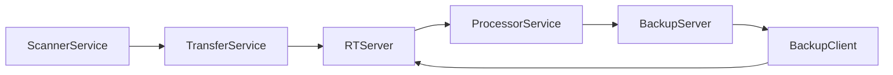

# Architecture

## Architecture Diagram

## Key System Capabilities

__1- File Indexing & Organization__

Group | Capability | Component(s)
------ | ------- | -----
File Indexing & Organization | Scans files across multiple local drives | ScannerService
File Indexing & Organization | Indexes files across multiple local drives | ProcessorService
File Indexing & Organization | Supports automatic file categorization (photos, videos, audio, documents) | ScannerService
File Indexing & Organization | Provides tagging functionality for file organization | RTServer
File Indexing & Organization | Tracks file metadata and creates searchable indexes | RTServer

__2-Multi-Platform Access__

Group | Capability | Component(s)
------ | ------- | -----
Multi-Platform Access | Web-based interface for desktop browsers | WebApp
Multi-Platform Access | Native mobile support for iOS and Android devices | RTServer
Multi-Platform Access | RESTful API for remote file access | RTServer
Multi-Platform Access | Streaming support for media files (including HLS for video) | RTServer

__3-File Sharing & Collaboration__

Group | Capability | Component(s)
------ | ------- | -----
File Sharing & Collaboration | User authentication with admin and regular user roles | RTServer
File Sharing & Collaboration | Secure file sharing with specific users or groups
File Sharing & Collaboration | Email integration for sending files and share notifications
File Sharing & Collaboration | Support for public/private file access controls

__4-Distributed Storage Architecture__

Group | Capability | Component(s)
------ | ------- | -----
Distributed Storage Architecture | Supports multiple storage nodes in a cluster | RTServer
Distributed Storage Architecture | File replication across nodes for redundancy |  RTServer, BackupClient, BackupServer
Distributed Storage Architecture | Remote cluster connectivity for accessing files from other Alterante servers | RTServer
Distributed Storage Architecture | Load balancing and failover capabilities | RTServer

__5-Backup & Sync__

Group | Capability | Component(s)
------ | ------- | -----
Backup & Sync | Automated backup to designated folders | BackupServer, BackupClient
Backup & Sync | Sync functionality between multiple drives/nodes | BackupServer, BackupClient
Backup & Sync | Integration with Amazon Cloud Drive for cloud backup | CloudBackup
Backup & Sync | Configurable retention and replication policies | BackupServer

__6-Security & Privacy__

Group | Capability | Component(s)
------ | ------- | -----
Security & Privacy | RSA and AES encryption for secure communications
Security & Privacy | Session-based authentication with UUID tokens
Security & Privacy | Support for hidden/private file collections
Security & Privacy | Secure remote access through encrypted channels

__7-Setup & Configuration__

Group | Capability | Component(s)
------ | ------- | -----
Setup | Web-based setup wizard for initial configuration | WebApp
Setup | Support for both server and client modes | RTServer
Setup | Configurable email settings for notifications | WebApp
Setup | Blacklist functionality for excluding folders | ScannerService

## Client-side components

Component           | Description
--------------      | -------------
[ScannerService](ScannerService.md)           | Scans for new/deleted/changes files in filesystem
[ScrubService](ScrubService.md)               | Extract metadata from files
[ClientService](ClientService.md)             | Find Server IP, Send Ping to Server
[ProcessorService](ProcessorService.md)       | Ingest metadata , add to local client index
[TransferService](TransferService.md)         | Package metadata into ZIP files, transfer to server
[BackupClientService](BackupClientService.md) | Process replication orders from server

## Server-side components
Component           						  | Description
-----------------   						  | -------------
[BroadcastService](BroadcastService.md)        | Broadcast Server IP address (discovered by Client)
[ProcessorService](ProcessorService.md)       | Ingest metadata, add to main index
[BackupServerService](BackupServerService.md) | Generate backup orders for clients
[RelayVaultService](RelayVaultService.md      | Communicaton to/from Relay Server (for traffic relay)
[WebServer](WebServer.md)                     | HTTP Web Server for REST API
AmazonDrive                                   | Synchronize files with Amazon S3 bucket
Mailer                                        | Fetch emails, execute email commands

