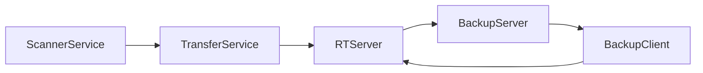

# Architecture

Component           | Description
--------------      | -------------
[ScannerService](ScannerService.md)           | Scans for new/deleted/changes files in filesystem
[ScrubService](ScrubService.md)               | Extract metadata from files
[ClientService](ClientService.md)             | Find Server IP, Send Ping to Server
[ProcessorService](ProcessorService.md)       | Ingest metadata , add to local client index
[TransferService](TransferService.md)         | Package metadata into ZIP files, transfer to server
[BackupClientService](BackupClientService.md) | Process replication orders from server

## Architecture Diagram

