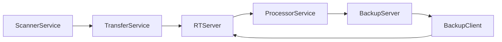

# Architecture

## Architecture Diagram

## Client-side components

Component           | Description
--------------      | -------------
[ScannerService](ScannerService.md)           | Scans for new/deleted/changes files in filesystem
[ScrubService](ScrubService.md)               | Extract metadata from files
[ClientService](ClientService.md)             | Find Server IP, Send Ping to Server
[ProcessorService](ProcessorService.md)       | Ingest metadata , add to local client index
[TransferService](TransferService.md)         | Package metadata into ZIP files, transfer to server
[BackupClientService](BackupClientService.md) | Process replication orders from server

## Server-side components
Component           						  | Description
-----------------   						  | -------------
BroadcastService](BroadcastService.md)        | Broadcast Server IP address (discovered by Client)
[ProcessorService](ProcessorService.md)       | Ingest metadata, add to main index
[BackupServerService](BackupServerService.md) | Generate backup orders for clients
[RelayVaultService](RelayVaultService.md      | Communicaton to/from Relay Server (for traffic relay)
[WebServer](WebServer.md)                     | HTTP Web Server for REST API
AmazonDrive                                   | Synchronize files with Amazon S3 bucket
Mailer                                        | Fetch emails, execute email commands

