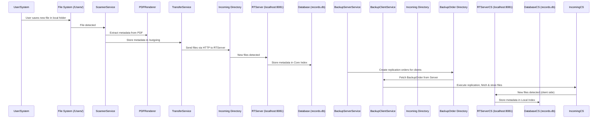

```mermaid
sequenceDiagram
    participant User as User/System
    participant FS as File System (/Users/)
    participant SCS as ScannerService
    participant PDF as PDFRenderer
    participant TS as TransferService
    participant Incoming as Incoming Directory
    participant RT as RTServer (localhost:8081)
    participant DB as Database (records.db)
    participant BSS as BackupServerService
    participant BCS as BackupClientService
    participant IncomingClient as Incoming Directory
    participant BO as BackupOrder Directory
    participant RTCS as RTServerCS (localhost:8081)
    participant DBCS as DatabaseCS (records.db)

    User->>FS: User saves new file in local folder
	 FS->>SCS: File detected
	 SCS->>PDF: Extract metadata from PDF
	 SCS->>TS: Store metadata in /outgoing
	 TS->>Incoming: Send files via HTTP to RTServer
	 Incoming->>RT: New files detected
	 RT->>DB: Store metadata in Core Index
	 BSS->>BO:  Create replication orders for clients
	 BO->>BCS: Fetch BackupOrder from Server
	 BCS->>IncomingCS: Execute replication, fetch & store files 
	 IncomingCS->>RTCS: New files detected (client side)
	 RTCS->>DBCS: Store metadata in Local Index
    
```