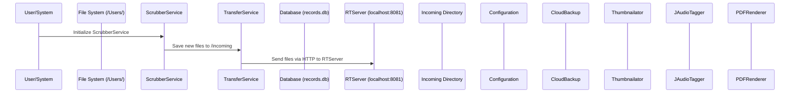

```mermaid
sequenceDiagram
    participant User as User/System
    participant FS as File System (/Users/)
    participant SS as ScrubberService
    participant TS as TransferService
    participant DB as Database (records.db)
    participant RT as RTServer (localhost:8081)
    participant Incoming as Incoming Directory
    participant Config as Configuration
    participant CB as CloudBackup
    participant Thumb as Thumbnailator
    participant Audio as JAudioTagger
    participant PDF as PDFRenderer

    User->>SS: Initialize ScrubberService
	 SS->>TS: Save new files to /incoming
	 TS->>RT: Send files via HTTP to RTServer	
    
```