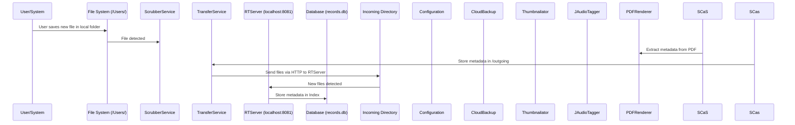

```mermaid
sequenceDiagram
    participant User as User/System
    participant FS as File System (/Users/)
    participant ScaS as ScrubberService
    participant TS as TransferService
    participant RT as RTServer (localhost:8081)
    participant DB as Database (records.db)
    participant Incoming as Incoming Directory
    participant Config as Configuration
    participant CB as CloudBackup
    participant Thumb as Thumbnailator
    participant Audio as JAudioTagger
    participant PDF as PDFRenderer

    User->>FS: User saves new file in local folder
	 FS->>ScaS: File detected
	 SCaS->>PDF: Extract metadata from PDF
	 SCas->>TS: Store metadata in /outgoing
	 TS->>Incoming: Send files via HTTP to RTServer
	 Incoming->>RT: New files detected
	 RT->>DB: Store metadata in Index
    
```