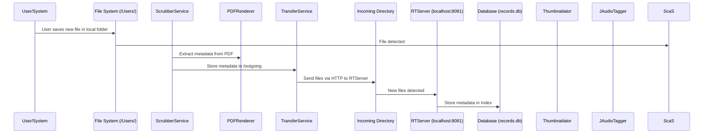

```mermaid
sequenceDiagram
    participant User as User/System
    participant FS as File System (/Users/)
    participant SCS as ScrubberService
    participant PDF as PDFRenderer
    participant TS as TransferService
    participant Incoming as Incoming Directory
    participant RT as RTServer (localhost:8081)
    participant DB as Database (records.db)
    participant Thumb as Thumbnailator
    participant Audio as JAudioTagger

    User->>FS: User saves new file in local folder
	 FS->>ScaS: File detected
	 SCS->>PDF: Extract metadata from PDF
	 SCS->>TS: Store metadata in /outgoing
	 TS->>Incoming: Send files via HTTP to RTServer
	 Incoming->>RT: New files detected
	 RT->>DB: Store metadata in Index
    
```