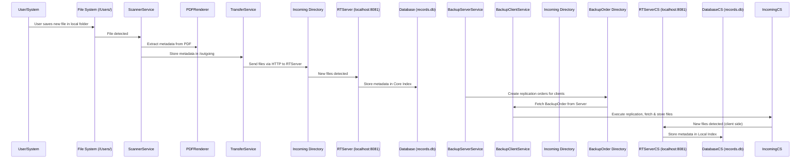

# Main workflow
**Steps**

1. User saves new file in local folder
2. File detected by ScannerService
3.	Metadata extracted from File
4. Metadata sent to RTServer
5. RTServer ingests metadata into Core Index
6. BackupServer creates replication order
7. Client fetches and executes replication order
8. File is replicated on Client
9. File detected by Client ScannerService
10. New file notification sent to Server

## Sequence Diagram

