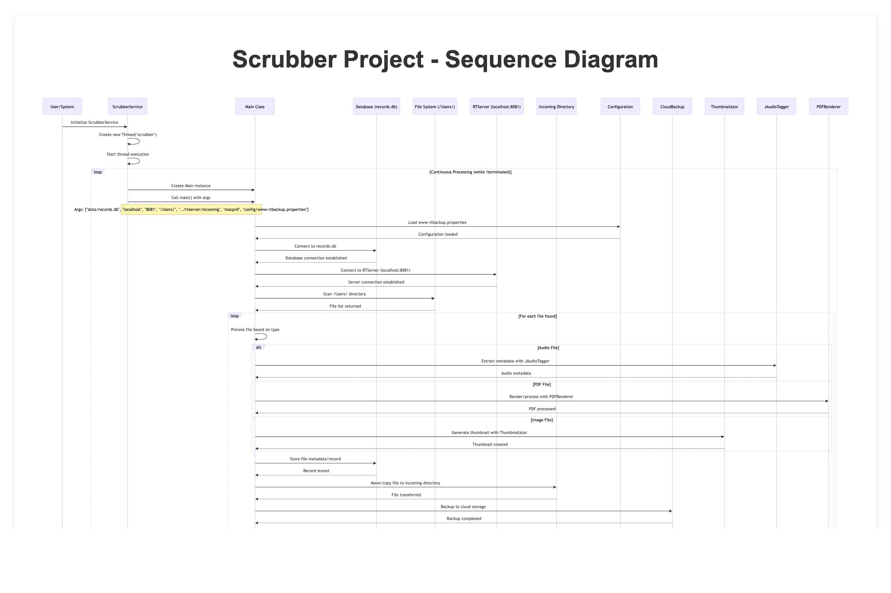
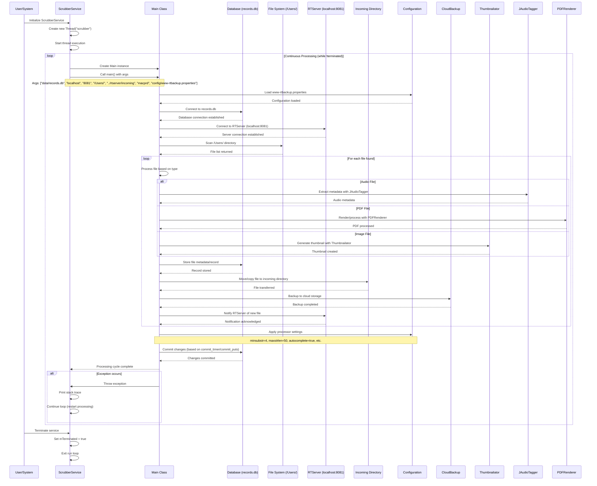

# **Scrubber**

Here's a sequence diagram for the Scrubber project based on the codebase analysis:

This sequence diagram illustrates the Scrubber project's main workflow:

1. **Initialization**: ScrubberService starts as a threaded service
2. **Continuous Processing**: Runs in a loop until terminated
3. **File Discovery**: Scans specified directories for files to process
4. **File Processing**: Handles different file types (audio, PDF, images) with specialized libraries
5. **Data Management**: Stores metadata in a local database and manages file transfers
6. **Integration**: Communicates with RTServer and performs cloud backups
7. **Configuration**: Uses property files to control processing behavior

The system appears to be designed for automated file processing, metadata extraction, and backup operations with real-time server integration.

